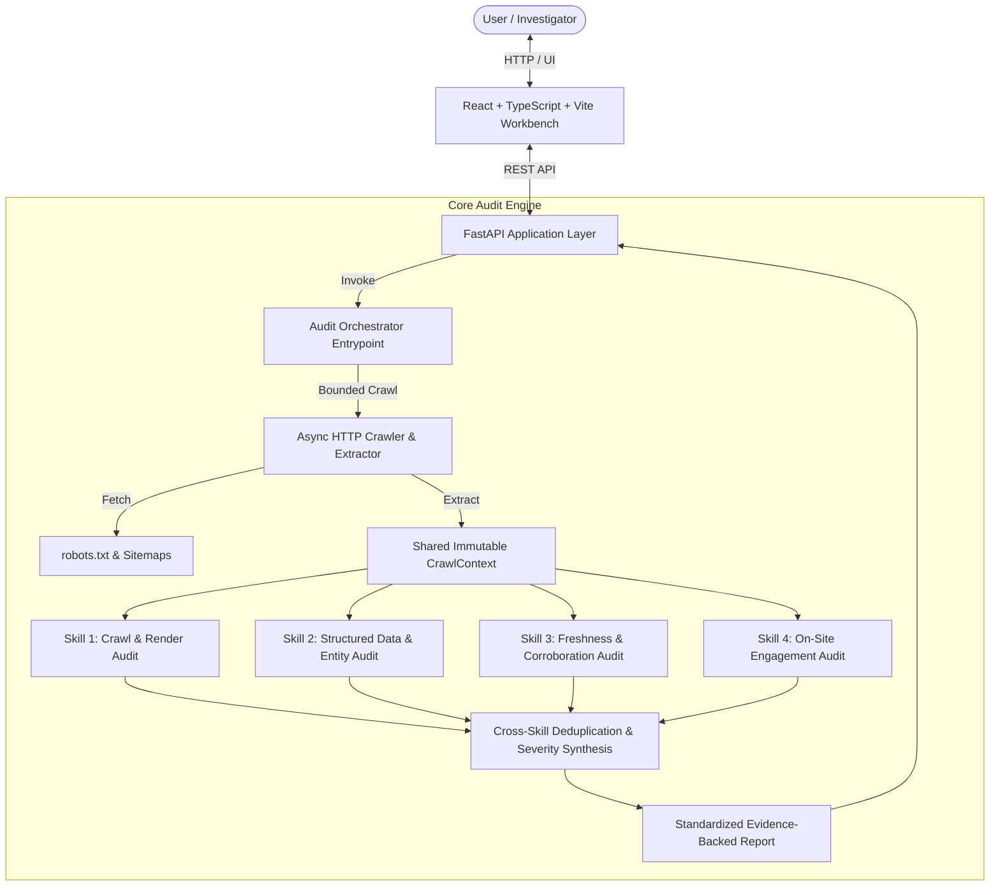

# WebVerity

## AI Readiness & Website Intelligence Workbench

> **Developed for Adobe University Hackathon 2026**  
> *WebVerity is an evidence-driven website intelligence platform and investigation workbench that analyzes how discoverable, machine-readable, trustworthy, and engaging a website is for modern AI systems, autonomous agents, and human visitors.*

---

## Table of Contents

- [Overview & Problem Statement](#overview--problem-statement)
- [The WebVerity Solution](#the-webverity-solution)
- [Investigation Workflow](#investigation-workflow)
- [Workbench Preview](#workbench-preview)
- [Key Features & Capabilities](#key-features--capabilities)
- [System Architecture](#system-architecture)
- [Agent Skill Marketplace Architecture](#agent-skill-marketplace-architecture)
- [Tech Stack](#tech-stack)
- [Repository Structure](#repository-structure)
- [Getting Started](#getting-started)
  - [Prerequisites](#prerequisites)
  - [Backend API Setup (FastAPI & Engine)](#backend-api-setup-fastapi--engine)
  - [Frontend Workbench Setup (React + TypeScript + Vite)](#frontend-workbench-setup-react--typescript--vite)
  - [CLI Usage](#cli-usage)
- [REST API Specification](#rest-api-specification)
- [Sample Investigation & Evidence Model](#sample-investigation--evidence-model)
- [Design Philosophy: Investigation Workbench](#design-philosophy-investigation-workbench)
- [Safety, Politeness & Security](#safety-politeness--security)
- [Testing & Quality Assurance](#testing--quality-assurance)
- [Known Limitations](#known-limitations)
- [Future Roadmap](#future-roadmap)

---

## Overview & Problem Statement

Modern websites are increasingly consumed not only by human visitors using desktop and mobile browsers, but by **autonomous AI agents, LLM answer engines, search assistants, and automated extractors**.

However, many web properties contain severe architectural defects:
- **Client-Side Rendering (CSR) Gaps:** Critical commercial facts, pricing, and product attributes are injected via client-side JavaScript hydration, leaving the initial HTTP body blank or incomplete for automated bots.
- **Structured Data Discrepancies:** Schema.org JSON-LD markup contains syntax errors, lacks entity grounding (`sameAs`), or directly contradicts visible rendered body copy.
- **AI Crawler Exclusions:** Unintentional or overly broad `robots.txt` rules block retrieval bots (e.g., `GPTBot`, `ClaudeBot`, `PerplexityBot`) from accessing public documentation and support manuals.
- **Temporal Staleness & Contradictions:** Outdated copyright dates, stale modifications, and cross-page factual discrepancies undermine brand trustworthiness.
- **On-Site Engagement Friction:** Disorganized semantic heading outlines (skipped H1 to H3 levels), missing value proposition orientation, and dead-end conversion pathways frustrate both visitors and navigational agents.

---

## The WebVerity Solution

**WebVerity** audits public websites across six critical dimensions:
1. **AI Discoverability:** Robots.txt bot rules, sitemap discovery, transport health.
2. **Machine Readability:** Server-rendered initial HTML vs. client-side hydration gaps.
3. **Structured Data:** Schema.org syntax, entity types, commercial product & offer coverage.
4. **Entity Clarity:** Knowledge graph disambiguation via authoritative sameAs links.
5. **Freshness & Consistency:** Temporal dates, outdated copyrights, cross-page factual corroboration.
6. **On-Site Engagement:** Heading hierarchy integrity, value proposition visibility, conversion paths.

**Core Principle: EVIDENCE IS THE PRODUCT.**  
WebVerity never fabricates scores or makes unsupported claims. Every single finding is backed by observable evidence, reproduction steps, root cause identification, and prioritized remediation actions.

---

## Investigation Workflow

WebVerity operates via a deterministic 5-stage pipeline:

```
DISCOVER  ──>  INSPECT  ──>  VERIFY  ──>  EXPLAIN  ──>  RECOMMEND
(Crawl &       (Raw vs.      (Schema &    (Causal       (Prioritized
 Sitemaps)      Rendered)     Freshness)   Chain)        Actions)
```

Finding Causal Chain:
$$\text{OBSERVATION} \longrightarrow \text{FORENSIC EVIDENCE} \longrightarrow \text{ROOT CAUSE} \longrightarrow \text{IMPACT} \longrightarrow \text{RECOMMENDED ACTION}$$

---

## Workbench Preview

```
+------------------------------------------------------------------------------------+
|  [>_] WEBVERITY v1.0 • AI READINESS & WEBSITE INTELLIGENCE   [API Connected] [New] |
+------------------------------------------------------------------------------------+
| Target: https://apex-cine-gear.example.com  •  Archetype: ECOMMERCE  •  Duration: 4.8s |
| [Total Findings: 4]  [Critical: 0]  [High: 2]  [Medium: 1]  [Low: 1]  [Info: 0]    |
+--------------------------+---------------------------------------------------------+
| NAVIGATION               | INVESTIGATION PANEL                                     |
|                          |                                                         |
| [•] All Findings (4)     | F-001  [HIGH]                                           |
| [ ] AI Discoverability   | Product specifications and pricing missing in raw HTML  |
| [ ] On-Site Engagement   | ------------------------------------------------------- |
| [ ] Audited Pages (8)    | 1. OBSERVATION: Core commercial facts absent in initial |
| [ ] Remediation Queue    |    HTTP response and injected purely client-side.       |
| [ ] Signal Matrix        | 2. FORENSIC EVIDENCE:                                   |
|                          |    Initial Body (26 chars): <div id="app">Loading...    |
|                          |    Rendered DOM: <p class="price">$4,999.00 USD</p>     |
|                          | 3. ROOT CAUSE: Asynchronous CSR hydration without SSR.  |
|                          | 4. IMPACT: LLM extractors cannot ingest catalog prices. |
|                          | 5. RECOMMENDED ACTION: Implement SSR for product pages. |
+--------------------------+---------------------------------------------------------+
```

---

## Key Features & Capabilities

- **Bounded Asynchronous Crawler:** Polite crawler with RFC 9309 `robots.txt` respect, sitemap XML discovery, soft cluster diversity, depth limits, and 429 rate-limit backoff.
- **Site & Page Archetype Classification:** Automated classification of websites (`ecommerce`, `b2b_saas`, `corporate`, `publisher`, `local_service`) and individual pages (`homepage`, `product_detail`, `pricing`, `about`, `contact`, `article`, `legal`, `faq`).
- **Raw vs. Rendered DOM Analysis:** Pinpoints critical product specs, prices, and copy that are missing from initial HTML responses.
- **Schema.org & Entity Graph Auditing:** Deep JSON-LD validation, syntax error trapping, `sameAs` entity disambiguation, and cross-validation between structured data and rendered visual text.
- **Freshness & Factual Consistency:** Scans for temporal staleness and detects cross-page factual contradictions across visited pages.
- **Semantic Engagement & Heading Inspector:** Audits H1-H6 hierarchy integrity, value proposition clarity, and contextual conversion pathways.
- **Strict Causal Chain Reporting:** Standardized format mapping `Observation -> Evidence -> Root Cause -> Impact -> Recommended Action`.
- **Proactive Recommendations Separation:** Distinguishes confirmed functional defects from proactive knowledge graph enrichment opportunities.

---

## System Architecture



---

## Agent Skill Marketplace Architecture

WebVerity is structured as an **Agent Skill Marketplace** registered under `marketplace.json`:

| Skill ID | Name | Role | Entrypoint |
| :--- | :--- | :--- | :---: |
| `audit-orchestrator` | **Audit Orchestrator** | Master coordinator: bounded crawl scheduling, skill execution, cross-skill deduplication, multi-factor severity scoring, and report synthesis. | **Yes** |
| `crawl-render-audit` | **Crawl & Render Audit** | Audits robots.txt AI bot exclusions, network transport headers, and client-side JavaScript rendering (CSR) content gaps. | No |
| `structured-data-entity-audit` | **Structured Data & Entity Audit** | Validates schema.org JSON-LD syntax, entity disambiguation via sameAs links, and checks for contradictions between structured data and visible text. | No |
| `freshness-corroboration-audit` | **Freshness & Corroboration Audit** | Detects temporal staleness (outdated copyrights, stale modified dates) and cross-page factual contradictions across site pages. | No |
| `engagement-audit` | **On-Site Engagement Audit** | Audits semantic heading hierarchies, above-the-fold value proposition orientation, buried answer discoverability, and contextual conversion paths. | No |

---

## Tech Stack

### Backend & Core Engine
- **Language:** Python 3.10+
- **HTTP Engine:** `httpx` (asynchronous, bounded concurrency, polite connection pooling)
- **HTML Parsing & Extraction:** `beautifulsoup4`
- **API Framework:** `FastAPI` (REST endpoints, OpenAPI documentation)
- **ASGI Server:** `uvicorn`
- **Data Validation:** `pydantic` v2 & Python dataclasses
- **Test Framework:** `pytest` & `pytest-asyncio`

### Frontend Workbench
- **Framework:** `React 19` + `TypeScript` + `Vite`
- **Styling:** `Tailwind CSS` (technical dark forensic workbench theme)
- **Icons:** `lucide-react`
- **State & Architecture:** Modular component hierarchy with live REST integration & fallback demo datasets

---

## Repository Structure

```
webverity/
├── audit/                             # Canonical CLI package entrypoint
│   ├── __init__.py
│   └── __main__.py
├── core/                              # Crawling, extraction, classification & models
│   ├── classifier.py                  # Page and site archetype classifier
│   ├── crawler.py                     # Bounded asynchronous HTTP crawler
│   ├── diff_analyzer.py               # Raw vs. Rendered DOM comparison
│   ├── engagement_analyzer.py         # Heading hierarchy & engagement analysis
│   ├── extractor.py                   # HTML metadata & content extractor
│   ├── freshness_analyzer.py          # Temporal dates & contradiction detection
│   ├── models.py                      # Immutable CrawlContext & PageEvidence dataclasses
│   ├── renderer.py                    # Rendering analysis utilities
│   ├── robots.py                      # RFC 9309 robots.txt parser & bot rule checker
│   ├── schema_analyzer.py             # Schema.org JSON-LD parser & validator
│   ├── sitemap.py                     # XML sitemap crawler & extractor
│   └── url_utils.py                   # URL normalization & domain extraction
├── docs/                              # Architecture, taxonomy, and research notes
│   ├── architecture.md
│   ├── audit-taxonomy.md
│   ├── requirements.md
│   └── research-notes.md
├── frontend/                          # React + TypeScript + Vite Investigation Workbench
│   ├── src/
│   │   ├── api/auditApi.ts            # REST API client with error handling
│   │   ├── components/                # Modular workbench components
│   │   │   ├── AuditProgressView.tsx  # Honest pipeline execution monitor
│   │   │   ├── DiscoverabilityView.tsx# AI discoverability focused inspector
│   │   │   ├── EngagementView.tsx     # On-site engagement inspector
│   │   │   ├── FindingDetail.tsx      # Causal chain (Observation->Evidence->Action)
│   │   │   ├── FindingsList.tsx       # Filterable findings list
│   │   │   ├── Header.tsx             # Workbench top bar & connection status
│   │   │   ├── LandingView.tsx        # Target input & category taxonomy matrix
│   │   │   ├── PagesInspector.tsx     # Crawled pages table & telemetry drawer
│   │   │   ├── RawReportModal.tsx     # Markdown / JSON export modal
│   │   │   ├── RecommendationsView.tsx# Prioritized remediation queue
│   │   │   ├── SeverityBadge.tsx      # Disciplined severity indicators
│   │   │   └── SignalMapView.tsx      # 2D signal distribution matrix
│   │   ├── mock/demoData.ts           # Realistic demo datasets for offline review
│   │   ├── types/audit.ts             # TypeScript domain models & DTOs
│   │   ├── App.tsx                    # Main workbench application state & router
│   │   ├── index.css                  # Tailwind styles & monospace typography
│   │   └── main.tsx                   # React root entrypoint
│   ├── package.json
│   ├── tailwind.config.js
│   ├── tsconfig.json
│   └── vite.config.ts
├── server/                            # FastAPI backend adapter
│   ├── __init__.py
│   ├── main.py                        # FastAPI application & REST endpoints
│   ├── schemas.py                     # Pydantic request & response DTOs
│   └── services/
│       └── audit_service.py           # Multi-skill audit coordination service
├── skills/                            # Agent Skill Marketplace skills
│   ├── audit-orchestrator/            # Master entrypoint skill
│   ├── crawl-render-audit/            # CSR & bot access skill
│   ├── structured-data-entity-audit/  # Schema.org & sameAs skill
│   ├── freshness-corroboration-audit/ # Staleness & contradiction skill
│   └── engagement-audit/              # Hierarchy & next-step skill
├── tests/                             # Comprehensive test suite (106 tests)
│   ├── test_api_server.py             # FastAPI REST endpoint tests
│   ├── test_audit_orchestrator.py     # Orchestrator & deduplication tests
│   ├── test_cli_and_reporting.py      # CLI & markdown rendering tests
│   ├── test_functional_validation.py  # End-to-end crawler & defect detection tests
│   └── ...
├── .env.example                       # Environment configuration template
├── marketplace.json                   # Agent Skill Marketplace registration
├── requirements.txt                   # Python dependencies
└── README.md
```

---

## Getting Started

### Prerequisites

- **Python:** 3.10 or higher
- **Node.js:** 18.0 or higher
- **npm:** 9.0 or higher

---

### Backend API Setup (FastAPI & Engine)

1. Clone or navigate to the project directory:
   ```bash
   cd webverity
   ```

2. Create and activate a Python virtual environment:
   ```bash
   # Linux / macOS
   python3 -m venv .venv
   source .venv/bin/activate

   # Windows (PowerShell)
   python -m venv .venv
   .venv\Scripts\Activate.ps1
   ```

3. Install backend dependencies:
   ```bash
   pip install -r requirements.txt
   ```

4. Start the FastAPI backend server:
   ```bash
   python -m server.main
   ```
   *The API will be live at `http://127.0.0.1:8000`. Interactive OpenAPI documentation is accessible at `http://127.0.0.1:8000/api/docs`.*

---

### Frontend Workbench Setup (React + TypeScript + Vite)

1. Open a new terminal and navigate to the `frontend/` directory:
   ```bash
   cd frontend
   ```

2. Install Node dependencies:
   ```bash
   npm install
   ```

3. Launch the Vite development server:
   ```bash
   npm run dev
   ```
   *Open your browser and navigate to `http://localhost:5173` to access the Investigation Workbench.*

---

### CLI Usage

The command-line interface provides fast terminal auditing with JSON and Markdown formatting:

```bash
# Run audit and output JSON to stdout
python -m audit https://example.com

# Run audit with Markdown report output
python -m audit https://example.com --format markdown

# Save report directly to file with custom bounds
python -m audit https://example.com --format markdown -o report.md --max-pages 15 --max-depth 2
```

---

## REST API Specification

### `GET /api/health`
Checks server health and subsystem readiness.
```json
{
  "status": "healthy",
  "version": "1.0.0",
  "timestamp": "2026-09-27T18:00:00Z",
  "services": {
    "crawler": "ready",
    "orchestrator": "ready",
    "skills": "ready",
    "api": "ready"
  }
}
```

### `POST /api/audit`
Executes an asynchronous bounded crawl, runs the domain skills, deduplicates findings, and returns the full audit report DTO.

**Request Payload:**
```json
{
  "url": "https://example.com",
  "max_pages": 10,
  "max_depth": 2,
  "timeout": 15.0
}
```

**Response Payload:**
```json
{
  "id": "aud_a1b2c3d4e5f6",
  "site": "https://example.com",
  "audited_at": "2026-09-27T18:00:05Z",
  "site_archetype": "corporate",
  "pages_audited": 6,
  "pages_discovered": 18,
  "crawl_duration_seconds": 3.42,
  "summary": {
    "total_findings": 1,
    "critical": 0,
    "high": 1,
    "medium": 0,
    "low": 0,
    "info": 0
  },
  "findings": [
    {
      "id": "F-001",
      "title": "Visible commercial product facts lack structured Product/Offer representation",
      "category": "structured_data",
      "severity": "high",
      "confidence": "high",
      "observation": "Product detail page contains pricing text but lacks schema.org JSON-LD.",
      "evidence": "URL: https://example.com/product/1\nMissing: Product JSON-LD block",
      "root_cause": "Commercial attributes are embedded only in visual HTML markup without corresponding machine-readable JSON-LD metadata.",
      "impact": "Automated assistants and AI shopping agents must rely on heuristic scraping.",
      "detection_method": "deterministic",
      "affected_urls": ["https://example.com/product/1"],
      "suggested_action": {
        "summary": "Embed standard schema.org Product and Offer JSON-LD blocks in server response.",
        "priority": "high"
      }
    }
  ],
  "proactive_recommendations": [],
  "pages": [...]
}
```

### `GET /api/audit/{audit_id}`
Retrieves a previously computed audit result from memory by its unique ID.

### `GET /api/audit/{audit_id}/report`
Returns the complete audit report formatted in clean GitHub-Flavored Markdown.

---

## Sample Investigation & Evidence Model

Here is an example of the strict causal chain produced by WebVerity:

```
[HIGH] F-001: Product specifications and pricing missing from initial HTML response
Category: Machine Readability | Confidence: High | Detection Method: Deterministic

1. OBSERVATION:
   Core commercial facts (price: $4,999.00 USD, sensor: Full-Frame 8K) are absent from
   the initial server HTTP response and injected purely client-side via JavaScript hydration.

2. EVIDENCE:
   Target URL: https://apex-cine-gear.example.com/products/cinema-camera-8k
   Initial HTTP Body Text (26 chars):
     <div id="app">Loading camera details...</div>

   Rendered DOM Extraction (248 chars):
     <div id="app">
       <h1>Cinema Camera 8K Pro</h1>
       <p class="price">$4,999.00 USD</p>
     </div>

3. ROOT CAUSE:
   Product attributes and pricing are fetched via client-side JavaScript APIs without Server-Side Rendering (SSR).

4. IMPACT:
   Automated AI retrieval crawlers and LLM search engines reading the raw HTTP stream fail to index pricing.

5. RECOMMENDED ACTION (Priority: High):
   Implement Server-Side Rendering (SSR) for product pages and include core attributes in the initial HTML markup.
```

---

## Design Philosophy: Investigation Workbench

The user interface is built as an **Investigation Workbench** rather than a generic SaaS dashboard:
- **Evidence First:** Exact character counts, JSON-LD fragments, and raw HTML excerpts are presented in monospace inspection blocks.
- **No Fabricated Scores:** We do not display artificial "AI Readiness Scores (e.g. 78%)". The health of a website is expressed via evidence-backed findings and severity counts.
- **Clear Causal Progression:** Findings visually connect `Observation -> Evidence -> Root Cause -> Impact -> Remediation`.
- **Restrained Visual Language:** Dark slate/zinc background, crisp typography, and disciplined severity accents prevent visual noise.

---

## Safety, Politeness & Security

WebVerity operates under strict ethical and technical boundaries:
- **Read-Only Inspection:** Never submits forms, modifies state, or performs destructive operations.
- **Strict Robots Compliance:** Fully parses and obeys RFC 9309 `robots.txt` directives for general crawlers and AI bots.
- **Bounded Concurrency:** Limits concurrent requests (default: 5 connections) and respects HTTP `429 Too Many Requests` backoff headers.
- **No Authentication Bypass:** Analyzes only public-facing web pages and never attempts credential stuffing or session hijacking.

---

## Testing & Quality Assurance

Run the comprehensive unit and integration test suite:

```bash
python -m pytest
```

*All 106 integration and unit tests pass in under 12 seconds.*

To validate frontend TypeScript types and build the production bundle:
```bash
cd frontend
npm run build
```

---

## Known Limitations

- **Bounded Crawl Depth:** Crawling is intentionally bounded (default: 10 pages, max depth: 2) to maintain fast turnaround and avoid server strain.
- **External Corroboration:** Cross-source entity corroboration requires public knowledge sources or structured record files passed via `--external`.
- **Private Intranets:** Pages protected by CAPTCHAs, Cloudflare managed challenges, or paywalls cannot be fetched without credentials.

---

## Future Roadmap

- [ ] Persistent SQLite / PostgreSQL audit history storage.
- [ ] Exportable PDF executive reports with customizable branding.
- [ ] Automated scheduled monitoring with Slack / Discord webhook alerts.
- [ ] Visual regression and DOM diff timeline between historical audits.
- [ ] Extended schema vocabulary support (e.g., MedicalEntity, FinancialProduct).

---

*WebVerity — Engineered for Adobe University Hackathon 2026*
