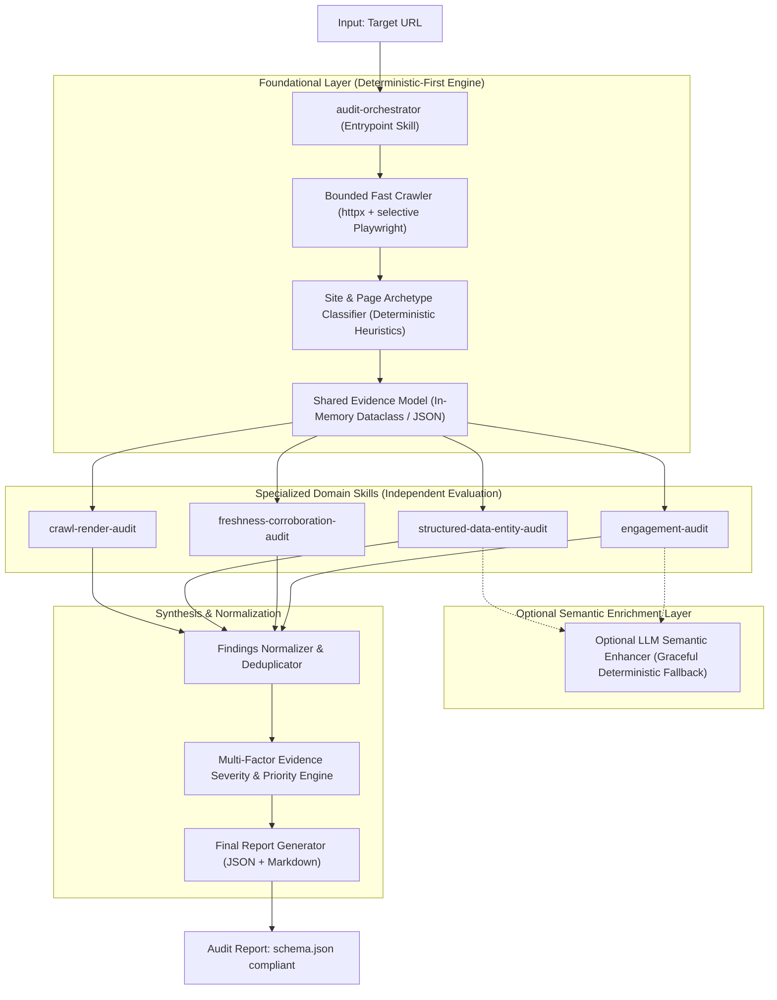
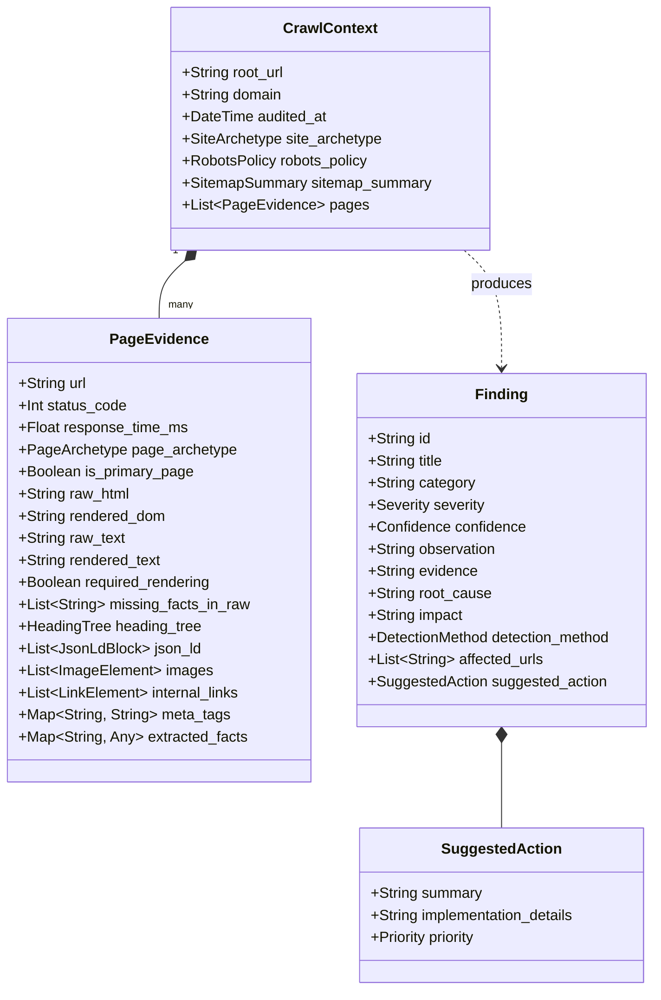

# Technical Architecture Design (Refined)

## 1. Architectural Overview & System Topology

The system is a modular **Agent Skill Marketplace** built to the `agentskills.io` specification. It accepts an arbitrary website URL and produces a structured, evidence-backed audit report covering **AI Discoverability** and **On-Site Engagement**.



---

## 2. Skill Responsibilities & Boundaries

The marketplace maintains strict separation of concerns with **exactly one entrypoint** and **four domain skills**:

```
brand-ai-readiness-audit/
├── marketplace.json                    # Marketplace Manifest (Designates entrypoint)
├── skills/
│   ├── audit-orchestrator/             # [ENTRYPOINT] Crawl plan, scheduling, deduplication, scoring, final report
│   ├── crawl-render-audit/             # [SKILL 1] Network, granular bot directives, JS hydration gaps, non-text traps
│   ├── structured-data-entity-audit/   # [SKILL 2] Schema.org AST validation, entity clarity, visible-vs-schema parity
│   ├── freshness-corroboration-audit/  # [SKILL 3] Temporal signals, cross-page factual consistency & conflicts
│   └── engagement-audit/               # [SKILL 4] Information hierarchy, orientation, answer proximity, CTAs
```

### Detailed Responsibility Matrix

| Skill | Role | Primary Inputs | Key Outputs | Evaluation Mechanism |
|---|---|---|---|---|
| **`audit-orchestrator`** *(Entrypoint)* | Orchestrates the end-to-end pipeline, partitions URL sample, executes skills, deduplicates findings, scores severity, generates final report. | Target URL, CLI options (`--max-pages`, `--timeout`, `--enable-llm`) | Final Audit Report (`audit_report.json`, `audit_report.md`) | Python runtime / CLI wrapper |
| **`crawl-render-audit`** | Audits crawler barriers and client-side rendering gaps. | Shared Evidence (Raw HTML, Rendered DOM, `robots.txt`, Network Logs) | Granular bot directive findings, confirmed missing factual content in CSR, non-text locked data. | Deterministic diffing + semantic token presence checks. |
| **`structured-data-entity-audit`** | Audits machine-readable knowledge graphs and entity representation. | Shared Evidence (Extracted JSON-LD, Microdata, OpenGraph, Visible Text) | Syntax errors, missing archetype-specific schema, and visible-to-schema factual contradictions. | Deterministic AST schema validation + rule-based fact matching (optional LLM enhancement). |
| **`freshness-corroboration-audit`** | Audits temporal validity and internal multi-page agreement. | Shared Evidence (Multi-page entity dictionary, footer timestamps, HTTP `Last-Modified`) | Outdated copyright/dates on active offerings, conflicting prices/claims across pages. | Deterministic date parsing + cross-page entity matrix reconciliation. |
| **`engagement-audit`** | Audits visitor orientation, heading hierarchy, and path-to-action. | Shared Evidence (DOM heading tree, vertical layout offsets, interactive elements, archetype) | Missing/multiple H1s, broken heading trees, buried key answers, missing contextual CTAs. | Deterministic DOM tree analysis + archetype-aware layout heuristics. |

---

## 3. Shared Evidence Model

To eliminate redundant HTTP fetches and avoid passing large unparsed blobs between skills, the orchestrator constructs an immutable, structured **Shared Evidence Model** during the crawl phase.



### Finding Causal Chain Structure
Every finding emitted by any skill must satisfy the 6-step causal chain:
$$\text{Observation} \longrightarrow \text{Evidence} \longrightarrow \text{Root Cause} \longrightarrow \text{Impact} \longrightarrow \text{Severity/Confidence} \longrightarrow \text{Recommendation}$$

```json
{
  "id": "F-001",
  "title": "Product price and stock status missing from initial HTML (CSR Dependent)",
  "category": "machine_readability",
  "severity": "high",
  "confidence": "high",
  "observation": "Raw HTML contains placeholder shell without product price, while rendered DOM displays '₹5,999' and 'In Stock'.",
  "evidence": "URL: /products/pro-camera (Primary Product Page). Raw text: 142 tokens; Rendered text: 840 tokens. Specific verified missing facts in initial HTML: ['₹5,999', 'In Stock', 'SKU-9921'].",
  "root_cause": "Product detail attributes are populated entirely via client-side React hydration without server-side rendering.",
  "impact": "Lightweight AI crawlers fetching raw HTML only cannot extract commercial terms, omitting the product from AI-generated shopping recommendations.",
  "detection_method": "deterministic",
  "affected_urls": ["https://example.com/products/pro-camera"],
  "suggested_action": {
    "summary": "Implement Server-Side Rendering (SSR) or Static Site Generation (SSG) for core product attributes.",
    "implementation_details": "Render the <span class=\"price\"> and stock status directly into the initial server response HTML.",
    "priority": "high"
  }
}
```

---

## 4. Foundational Archetype Classification

Audit checks are strictly context-aware and avoid false positives by classifying both the site and individual pages:

```
┌────────────────────────────────────────────────────────────────────────────────────────┐
│                               ARCHETYPE CLASSIFIER                                     │
├────────────────────────────────────────────────────────────────────────────────────────┤
│ 1. Site Archetype (Inferred from root DOM, URL paths, and meta-data)                   │
│    • E-Commerce / D2C (e.g., cart routes, checkout, shop categories, currency symbols) │
│    • B2B SaaS / Enterprise (e.g., /pricing, /features, /docs, /demo, sign-up CTA)      │
│    • Local / Professional Services (e.g., address, phone, booking, service radius)     │
│    • Content / Publisher (e.g., articles, blog, author bylines, publication dates)    │
│    • Corporate / Institutional (e.g., about, leadership, investors, press releases)    │
├────────────────────────────────────────────────────────────────────────────────────────┤
│ 2. Page Archetype (Inferred per crawled URL)                                           │
│    • Homepage | Product Detail | Category/Catalog | Pricing | Article/Blog | Contact   │
└────────────────────────────────────────────────────────────────────────────────────────┘
```

---

## 5. Precise AI Crawler Directives Interpretation

Instead of claiming universal "AI Invisibility", crawler directives are analyzed with precision:

```
┌────────────────────────────────────────────────────────────────────────────────────────┐
│                        GRANULAR BOT DIRECTIVE ANALYSIS MATRIX                          │
├────────────────────────────────────────────────────────────────────────────────────────┤
│ 1. Specific Bot Identification:                                                        │
│    • Real-Time Search & RAG Bots (PerplexityBot, ChatGPT-User, Bingbot):               │
│      Impact: Blocks live citation in conversational search answers.                    │
│    • Offline Ingestion & Training Bots (GPTBot, ClaudeBot, Google-Extended):           │
│      Impact: Excludes site knowledge from future foundational model training.          │
│    • General Crawlers (Googlebot, Bingbot):                                            │
│      Impact: Impacts core web search indexation.                                       │
├────────────────────────────────────────────────────────────────────────────────────────┤
│ 2. Blocked Route Scope:                                                                │
│    • Disallow: /                                                                       │
│      Scope: Site-wide blockade for the specific bot.                                   │
│    • Disallow: /products/ or /pricing/                                                 │
│      Scope: Targeted barrier on key commercial discovery assets.                       │
│    • Disallow: /admin/, /checkout/, /cart/                                             │
│      Scope: Standard security practice; NOT reported as a defect.                      │
└────────────────────────────────────────────────────────────────────────────────────────┘
```

---

## 6. Selective Rendering vs Confirmed CSR Defects

To optimize runtime and prevent false alarms:
1. **Trigger Phase (Signal Only)**:
   - `raw_text_length < 300`, low raw-to-rendered ratio, or framework placeholder signatures (`<div id="root"></div>`) serve **only as an internal trigger** to launch selective headless rendering.
2. **Defect Verification Phase (Evidence Required)**:
   - A CSR defect is **only emitted** if substantive, factual information (e.g. product title, price, operating hours, key specifications) is proven present in the rendered DOM but completely missing from the raw HTML.
   - Cosmetic diffs (session IDs, tracking scripts, ad banners, dynamic styles) are filtered out and ignored.

---

## 7. Multi-Factor Severity & Confidence Model

Severity is evaluated holistically using a multi-factor assessment:

$$\text{Severity} = f(\text{Impact}, \text{Scope}, \text{Page Importance}, \text{Evidence Strength})$$

### Multi-Factor Evaluation Criteria

| Factor | Evaluation Scale | Description |
|---|---|---|
| **Impact** | Critical / High / Medium / Low | Degree to which the issue blocks discovery, creates hallucination risk, or halts visitor engagement. |
| **Scope** | Site-Wide / Path-Specific / Single-Page | Breadth of affected URLs across the domain. |
| **Page Importance** | Primary (Homepage, Main Product, Pricing) / Secondary (Archive, Sub-category, Old Post) | Strategic value of the affected route. |
| **Evidence Strength** | Direct (Exact HTTP/DOM/AST proof) / Corroborated / Heuristic | Defensibility and reproducibility of the observation. |

### Resulting Severity Tiers
- **Critical**: Severe impact on a primary page with site-wide scope and direct evidence (e.g. `User-agent: * Disallow: /` in `robots.txt` OR price contradiction between schema and primary product page).
- **High**: Significant discovery or engagement barrier on primary/commercial pages (e.g. core product price missing from raw HTML OR zero CTAs on primary landing page).
- **Medium**: Friction or authority gap on secondary pages or non-blocking optimization gaps (e.g. outdated copyright year OR missing `sameAs` on About page).
- **Low / Info**: Minor technical nitpicks or proactive optimization opportunities (e.g. opportunity to add `FAQPage` schema).

### Confidence Scoring
- **High**: Deterministic direct evidence (HTTP response status, exact DOM inspection, AST syntax error).
- **Medium**: Strong heuristic pattern or multi-page text matching.
- **Low**: Inferred observation from partial crawl sample.

---

## 8. Deterministic Core with Optional LLM Layer

The system is designed with a **100% standalone deterministic core**:

```
┌────────────────────────────────────────────────────────────────────────────────────────┐
│                        DETERMINISTIC CORE (ALWAYS ACTIVE, NO API KEY)                  │
│  • Async HTTP fetch + selective Playwright rendering                                   │
│  • Robots.txt parsing, canonical resolution, sitemap XML extraction                    │
│  • Raw vs Rendered DOM token extraction and fact-presence diffing                       │
│  • JSON-LD AST parsing, schema.org validation, entity type checks                      │
│  • DOM heading tree traversal (H1-H6), vertical offset calculations                    │
│  • Rule-based archetype classifier and cross-page entity dictionary reconciliation     │
└────────────────────────────────────────────────────────────────────────────────────────┘
                                              ▲
                                              │ (Optional / Graceful Enhancement)
┌────────────────────────────────────────────────────────────────────────────────────────┐
│                   OPTIONAL LLM SEMANTIC ENHANCER (PLUGGABLE / OPT-IN)                  │
│  • Nuanced brand value proposition synthesis                                           │
│  • Complex natural-language copy vs JSON-LD semantic alignment                         │
│  • Tailored proactive copy and schema recommendations                                  │
│  • If no API key is provided, the system executes cleanly via deterministic fallbacks! │
└────────────────────────────────────────────────────────────────────────────────────────┘
```

---

## 9. Crawler Architecture & Bounded Runtime Strategy (< 5 Minutes)

- **Engine**: Async `httpx` for fast concurrent HTML extraction + selective `playwright` for JS-heavy pages.
- **Page Ceiling**: Max **15–20 representative pages** (Home + 3-5 Products/Services + Pricing + About + Contact + 2 Articles).
- **Render Budget**: Max **5 pages** rendered via headless browser with strict 10s timeout.
- **Depth Limit**: Max depth **2** from seed URL.
- **Package Size**: Zero binary models; total distribution package <= 40 MB (fits well inside the 50 MB ZIP limit).
