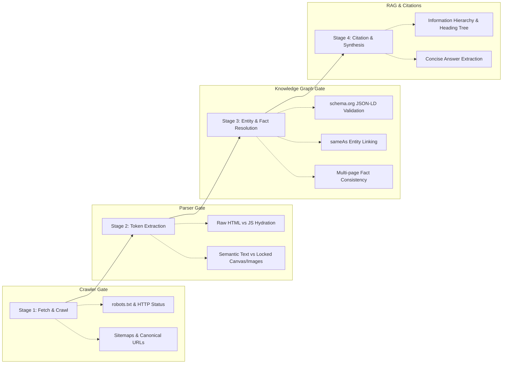

# Phase 0 Research Notes: AI Discoverability & On-Site Engagement Mechanisms

## 1. Context & Synthesis of Round 2 Failure Modes

In Round 2, we examined the systemic reasons why brands experience AI invisibility, hallucinated facts, stale representation, and high landing bounce rates. In Round 3, our objective is to translate those qualitative failure mechanisms into **automated, observable, evidence-backed inspection signals**.

### Translation of Core Failure Modes into Observable Audit Signals

```
┌──────────────────────────────────────┐       ┌─────────────────────────────────────────────────────────┐
│     Round 2 Qualitative Problem      │  ───> │             Round 3 Observable Audit Signal             │
├──────────────────────────────────────┤       ├─────────────────────────────────────────────────────────┤
│ 1. AI Invisibility & Crawl Gaps      │  ───> │ robots.txt AI-crawler disallows, 4xx/5xx headers,       │
│                                      │       │ missing sitemaps, unresolvable canonical loops          │
├──────────────────────────────────────┤       ├─────────────────────────────────────────────────────────┤
│ 2. Client-Side Rendering Gaps        │  ───> │ Price, availability, core specs present in rendered DOM │
│                                      │       │ but completely missing in initial Raw HTML              │
├──────────────────────────────────────┤       ├─────────────────────────────────────────────────────────┤
│ 3. Non-Text Locked Facts             │  ───> │ Critical data (menus, specs, tables, pricing) trapped   │
│                                      │       │ inside raw images/canvases with empty or generic alt    │
├──────────────────────────────────────┤       ├─────────────────────────────────────────────────────────┤
│ 4. Structured Data Deficiencies      │  ───> │ Missing JSON-LD, invalid schema types, or severe        │
│                                      │       │ conflicts between JSON-LD properties and visible text   │
├──────────────────────────────────────┤       ├─────────────────────────────────────────────────────────┤
│ 5. Entity Ambiguity & Disconnect     │  ───> │ Organization/Brand lacks sameAs Wikidata/social IDs;    │
│                                      │       │ ambiguous naming collisions without disambiguation      │
├──────────────────────────────────────┤       ├─────────────────────────────────────────────────────────┤
│ 6. Temporal Staleness & Inconsistency│  ───> │ Expired copyright, outdated lastmod/dateModified,       │
│                                      │       │ internal contradictory facts across indexed subpages    │
├──────────────────────────────────────┤       ├─────────────────────────────────────────────────────────┤
│ 7. On-Site Engagement Drop-off       │  ───> │ Missing Above-The-Fold value proposition, broken H1-H6  │
│                                      │       │ tree, buried answers, dead-end pages lacking clear CTAs │
└──────────────────────────────────────┘       └─────────────────────────────────────────────────────────┘
```

---

## 2. Real-World AI Retrieval & Comprehension Pipeline

Modern AI discovery agents (e.g., Perplexity, ChatGPT Search, Gemini, Claude Web Retrieval, Google SGE) and AI crawlers (e.g., `GPTBot`, `ClaudeBot`, `PerplexityBot`, `Google-Extended`) process the web through a 4-stage pipeline:



### Key Technical Bottlenecks Identified in the Wild:
1. **Lightweight Crawlers Skip JavaScript Execution**: High-scale AI ingestion pipelines rely on fast, cost-effective HTTP extractors (raw HTML) rather than heavyweight headless Chromium instances. When critical entities (pricing, specifications, service lists) exist solely in client-side state bundles (React/Vue hydration payload), the crawler indexes an empty shell.
2. **Schema Inconsistency Triggers Extraction Discard**: If JSON-LD states `price: 49.99` but the raw DOM displays `$59.99` (due to un-synced tag managers or stale caching), automated verifiers flag the source as untrusted or conflicting, leading to citation omission.
3. **Entity Collision without `sameAs`**: AI models disambiguate entities by looking up verified authority identifiers (Wikidata QIDs, official social graph URLs, Crunchbase, Google Knowledge Graph IDs). When a website mentions a generic name without explicit Organization schema and `sameAs` bindings, RAG systems frequently hallucinate or attribute attributes to competitor entities.

---

## 3. Deterministic vs LLM Semantic Verification Division

To ensure **high performance (< 5 min runtime)**, **reproducible evidence**, and **cost efficiency**, we establish a strict boundary between deterministic algorithmic checks and LLM-assisted semantic reasoning.

```
┌─────────────────────────────────────────────────────────────────────────────────────────────┐
│                                DETERMINISTIC CHECKS (FAST, EXACT)                           │
│  • HTTP status code, redirect chains, SSL validation                                        │
│  • robots.txt parsing against major AI User-Agents (GPTBot, ClaudeBot, etc.)                │
│  • Sitemap XML parsing and URL coverage analysis                                            │
│  • Raw HTML vs Rendered DOM text-length and token-diff ratios                               │
│  • JSON-LD extraction, JSON syntax validation, schema.org type verification                 │
│  • Heading structure hierarchy (H1 presence, skipped levels H1->H3)                         │
│  • Image alt attribute audit on content-heavy images                                        │
│  • Outbound/Inbound link counts, broken anchor detection, canonical link matching          │
└─────────────────────────────────────────────────────────────────────────────────────────────┘
                                              │
                                              ▼ (Shared Evidence Bundle)
┌─────────────────────────────────────────────────────────────────────────────────────────────┐
│                             LLM SEMANTIC REASONING (CONTEXT-AWARE)                          │
│  • Archetype Classification (E-commerce vs B2B SaaS vs Publisher vs Local Service)          │
│  • Fact Alignment: Does visible page text corroborate the JSON-LD schema claims?             │
│  • Value Proposition Clarity: Can a human/AI deduce the core offering in <= 5 seconds?      │
│  • Intent Continuity & Buried Answers: Does the page directly answer the core user query?   │
│  • Proactive Recommendations: Non-obvious architectural or semantic markup suggestions       │
└─────────────────────────────────────────────────────────────────────────────────────────────┘
```

---

## 4. False-Positive Mitigation & Archetype Awareness

A common failure mode in generic website auditing tools is reporting **irrelevant best practices as severe bugs** (e.g., complaining that a personal portfolio site lacks `Product` JSON-LD). 

### Archetype-Aware Validation Matrix

| Website Archetype | Expected Schemas | Expected Key Facts | Low-Priority / Ignored Signals |
|---|---|---|---|
| **E-Commerce** | `Product`, `Offer`, `BreadcrumbList`, `Organization` | Price, Currency, SKU, Availability, Shipping, Return Policy | Detailed corporate bios, academic citations |
| **B2B SaaS** | `SoftwareApplication`, `Organization`, `FAQPage` | Features, Pricing Tiers, Integrations, Security/Compliance | Physical product dimensions, SKU numbers |
| **Local Services** | `LocalBusiness`, `PostalAddress`, `OpeningHoursSpecification` | Address, Phone, Geo Coordinates, Service Area, Operating Hours | Global e-commerce shipping terms |
| **Publisher / Blog** | `Article`, `NewsArticle`, `Author`, `Organization` | Author Byline, Date Published, Date Modified, Main Entity | Commercial `Offer` / SKU attributes |
| **Corporate / Institutional** | `Organization`, `AboutPage`, `ContactPage` | Leadership, Mission, Official Headquarters, Contact Channels | Product catalogs, shopping carts |

### Strict Rules to Eliminate False Positives:
1. **Never flag cosmetic DOM diffs**: Dynamic tracking pixels, ad injection containers, session tokens, or random CSS class hashes must be filtered out before comparing raw vs rendered DOM.
2. **Never flag optional Schema properties as Critical defects**: Missing `aggregateRating` on a brand-new product is an informational recommendation, never a high/critical defect.
3. **Never penalize single-page static sites for short navigation**: Single-page landing pages with in-page anchor navigation (`#contact`) should not be flagged for low internal page link counts.
4. **Distinguish Intentional Blockers from Defects**: Blocking internal staging paths (`/admin`, `/checkout`, `/cart`) in `robots.txt` is an intentional security practice and must not be flagged as a crawlability defect.
